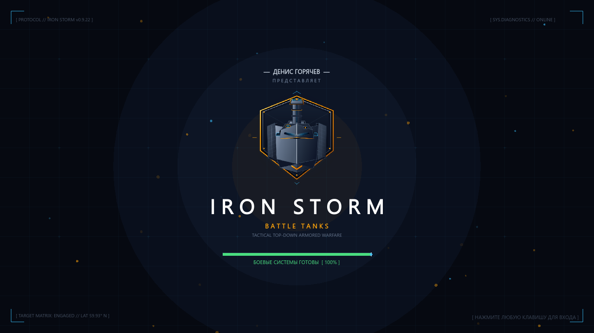

# Iron Storm — Battle Tanks

Top-down танковый шутер на **Godot 4.7** (рендер GL Compatibility — идёт на слабом железе
и встроенной графике). Бои против ботов, игра вдвоём за одним компьютером и сетевой
мультиплеер через ENet или Steam.



## Возможности

- **Режимы:** Каждый за себя, Захват флага, Царь горы (три босса и тонущая арена),
  Оборона базы от волн, обучающий Курс молодого бойца
- **Локации:** Город, Равнина, Пустошь, Джунгли, Зимний город, Промзона, Побережье,
  Пустынный посёлок — карты генерируются процедурно (сетка кварталов, кольца и
  проспекты, органические тропы, береговая линия с островами)
- **Боссы:** Бронемонстр, Джаггернаут-Таран, Фантом-Химера — с фазами и телеграфами атак
- **Прокачка:** перки и синергии-билды, пушки (стандартная, ледяная, кислотная),
  улучшения и косметика в гараже, ранги, достижения, бестиарий
- **Ежедневные и недельные задания**, мутаторы, адаптивная сложность
- **Погода и время суток**, разрушаемые постройки, мины, авиаудар
- **Мультиплеер:** hot-seat вдвоём, онлайн по ENet/Steam, выделенный сервер
- Геймпады, переназначение клавиш, тач-управление, языковые пакеты

## Управление (по умолчанию)

| Действие | Игрок 1 | Игрок 2 (hot-seat) |
|---|---|---|
| Движение | W A S D | Стрелки / Num 8 4 2 6 |
| Прицел | Мышь | `,` `.` / Num 7 9 |
| Выстрел | ЛКМ / Space | `/` |
| Мина | E / ПКМ | Delete |
| Рывок | Shift | Num + |
| Способность | Q | Num − |
| Авиаудар | F | — |
| Пауза | Esc / P | |
| Таблица счёта | Tab | |

Клавиши переназначаются в настройках; геймпады подхватываются автоматически.

## Запуск из исходников

1. Установите [Godot 4.7](https://godotengine.org/download) (стандартная сборка, не .NET).
2. Откройте `godot/project.godot` в редакторе и нажмите **F5**.

Папка `godot/.godot/` — кэш редактора, она не хранится в git и создаётся при первом
открытии проекта.

## Сборка exe

Экспорт делается пресетом **Windows** из `godot/export_presets.cfg`:

```bash
cd godot
godot --headless --path . --export-release "Windows" "../build/Tanchiki.exe"
```

Рядом с exe должны лежать `libgodotsteam.windows.template_release.x86_64.dll` и
`steam_api64.dll` — экспорт кладёт их в `build/` сам.

Перед каждой сборкой поднимайте версию **в двух местах сразу**: `config/version` в
`godot/project.godot` и `application/file_version` + `application/product_version` в
`godot/export_presets.cfg`. Проверка, что они совпадают:

```bash
godot --headless --path godot tests/version_check.tscn
```

## Выделенный сервер

```bash
Tanchiki.exe --headless --server --port=8124 --players=2 --mode=ffa --difficulty=medium
```

Дополнительно: `--level=`, `--weather=`, `--daytime=`, `--location=`.

## Тесты

Тесты — обычные сцены в `godot/tests/`, запускаются headless:

```bash
godot --headless --path godot tests/smoke.tscn        # все режимы целиком
godot --headless --path godot tests/map_check.tscn    # генератор карт
godot --headless --path godot tests/perks_check.tscn  # перки и билды
```

Код выхода 0 — проблем нет. Тесты, которые пишут отчёт в файл, кладут его в папку
данных игры (`%APPDATA%\Godot\app_userdata\Iron Storm\`), а не в репозиторий.

Быстрая проверка, что все скрипты компилируются: запустить главную сцену и убедиться,
что в выводе нет `SCRIPT ERROR` / `Parse Error`:

```bash
godot --headless --path godot --quit-after 60
```

## Структура проекта

```
godot/
  project.godot, export_presets.cfg
  scenes/         — главная сцена и UI-сцены
  scripts/
    game.gd       — состояние игры, меню, старт и конец матча
    world.gd      — симуляция матча (фиксированный шаг 60 Гц)
    world_view.gd — отрисовка мира
    tank.gd, bot.gd, entities.gd — танки, ИИ, снаряды и объекты
    perks.gd, cannons.gd, weapons.gd, enemy_types.gd — баланс
    level_gen.gd + mapgen/ — процедурная генерация карт
    net/          — мультиплеер (ENet, Steam)
    ui/           — меню, гараж, HUD, редактор карт
    fx/           — пост-эффекты, свечение, затенение
  art/, music/, sfx/, shaders/ — ресурсы
  addons/         — GodotSteam, редактор прогрессии перков
  tests/          — headless-тесты
build/            — собранный exe и dll, sync_to_usb.ps1
docs/             — аналитический отчёт по проекту
screenshots/      — скриншоты
```
